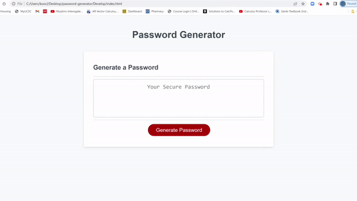

# JavaScript: [Password Generator][]

## At First Glance

This is a web application hosting a password generator. The user must first specify a valid password length between 8 to 128 characters. Next, the user will be asked for specifications for the password generated, including the option to include lower and uppercase characters, numbers, and special characters compatible with password generations.

## Tools Used

As the title may have indicated, this password generator was made using javascript. The javascript was then linked as an external script on the HTML web application, formatted CSS styling elements.

The following is a sample of the javascript.

```
// Generates random numbers
function randomNo(x,y){
    var min = x;
    var max = y;
    
    var randomNo = Math.floor(Math.random()*(max-min+1)+min);
    
    return randomNo;
}

// Generates random alphabetical letters
var codebaseAlpha = "abcdefghijklmnopqrstuvwxyz".split("");
var randomAlpha = codebaseAlpha[randomNo(0,25)];

// Generates random characters
var codebaseSpecial = "!#$%&'()*+,-./:;<=>?@[]^_`{|}~".split("");
var randomSpecial = codebaseSpecial[randomNo(0,codebaseSpecial.length-1)];
```

For this project, a function for generating random numbers between two specified integers was written. The function proved to be a key part of the source code, as the function was later reused a few more times for other variables made to generate random characters from sets of arrays. The last few lines from the code snippet, for example, is a demonstration of how the random number generating function is later used.

## Mock-Up

The following image shows the web application's appearance:


The following image shows the web application's functionality:



- - -
© 2022 Clement Koo
[LinkedIn][https://www.linkedin.com/in/clement-t-k-459322138/]
[Portfolio][https://c-k999.github.io/proto-professional-portfolio/]
